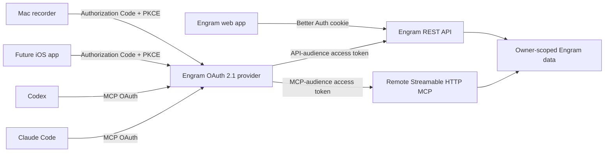

# Engram Unified Authentication Implementation Plan

**Date:** 2026-07-24
**Status:** Phase 0 complete; Phase 1A deployed and audited; Phase 2 server foundation and isolated local lifecycle gate complete behind a disabled production flag; Phase 3 Mac browser auth and disconnect verified locally, with the storage-backed recording lifecycle and rollout still pending
**Authority:** This is the source of truth for Engram authentication work until it is superseded by a newer dated plan.

## Goal

Replace Engram's deployment-wide Mac recorder token with one consistent authorization system that:

- keeps the existing web login working;
- ships the current Mac app on OAuth 2.1 Authorization Code + PKCE;
- is ready to be reused by a future native iOS app;
- authenticates a read-only remote MCP server used from Codex and Claude Code;
- identifies the user, client, audience, scopes, and grant behind every request;
- supports expiration, refresh, per-connection revocation, ownership checks, and useful audit logs; and
- can be rolled out without losing queued recordings or stranding an older Mac build.

The intended end state is not merely "valid tokens." Authentication establishes a principal; authorization then checks that principal's audience, scopes, ownership, and operation.

## Architecture

Engram remains its own identity and authorization system. Better Auth continues to provide browser sessions and is extended with its OAuth 2.1 Provider. The REST API and MCP endpoint are separate protected resources with different audiences and scope policies.



## Tech Stack

- Next.js 16.2.6 App Router, TypeScript, React 19
- Better Auth 1.6.20 today; exact compatible Better Auth and OAuth Provider versions must be pinned during Phase 0
- Drizzle ORM + PostgreSQL
- `@modelcontextprotocol/sdk` 1.29.x
- Swift/SwiftUI macOS app using `ASWebAuthenticationSession`, CryptoKit, and Keychain Services
- pnpm only

## Current State and Why It Must Change

### Browser

- `auth.ts` uses Better Auth email/password sessions.
- Browser sessions last 30 days and are validated with `auth.api.getSession`.
- Server Components use `lib/auth-guard.ts`; API routes mostly call Better Auth directly.

### Mac recorder

- `MAC_RECORDER_API_TOKEN` is one non-expiring deployment secret.
- `lib/recordings/auth.ts` maps it to the coarse role `"recorder"`.
- The Mac user pastes the token into Settings; it is stored in Keychain and passed into every API call.
- The token has no user ID, client ID, device/grant ID, audience, scopes, expiry, refresh, or independent revocation.
- The token can upload and can delete any recording with `source = "mac"`. `source` is metadata, not an authorization boundary.

### Data authorization

- All app-domain tables are deployment-global even though Better Auth has users.
- `recordings` has no owner, and transcript search searches the complete corpus.
- Plaud credentials/state, settings, glossary, backups, and speakers are global.
- Several uniqueness constraints are global: Plaud file ID, credential provider, and speaker name.

OAuth must not be exposed to more clients until ownership and request-level authorization are real.

## Locked Decisions

| Area              | Decision                                                                                                                                                                                                                    |
| ----------------- | --------------------------------------------------------------------------------------------------------------------------------------------------------------------------------------------------------------------------- |
| Identity provider | Engram remains the identity provider through Better Auth. Do not introduce a second hosted identity provider for this phase.                                                                                                |
| Browser           | Keep Better Auth cookie sessions. Do not turn the browser UI into an OAuth client.                                                                                                                                          |
| Native clients    | Mac and iOS are pre-registered **public clients**. They have no client secret and must use Authorization Code + PKCE S256 through the system browser.                                                                       |
| MCP transport     | Remote Streamable HTTP at one canonical HTTPS URL, initially `/mcp`. Do not build a local stdio wrapper as the primary integration.                                                                                         |
| MCP registration  | Use the interoperable mechanism proved in Phase 0. Stable Dynamic Client Registration is acceptable initially; add Client ID Metadata Documents when the chosen stable Better Auth release supports them.                   |
| Resources         | REST API and MCP have different canonical resource/audience values. Tokens are never interchangeable between them.                                                                                                          |
| MCP capabilities  | V1 is read-only: transcript search and transcript retrieval, with an optional summary read tool. No audio, uploads, deletes, regeneration, speaker edits, backups, credentials, or Plaud operations.                        |
| Ownership         | User-derived data is owner-scoped before OAuth/MCP expansion. True deployment configuration such as the storage backend may remain global.                                                                                  |
| Migration         | Additive rollout: ownership + dual auth server, OAuth Mac release, soak, disable legacy token, later remove legacy code, then MCP.                                                                                          |
| Revocation        | Connections/grants can be revoked from the web. "Disconnect this Mac" revokes server-side access before clearing local credentials.                                                                                         |
| Token storage     | Native renewable refresh credentials go in device-only Keychain storage keyed by issuer + account + client. Rotate them when the pinned provider behavior has been verified. Access tokens are memory-only where practical. |
| Secrets           | Never embed a client secret in Mac/iOS. Never log tokens, authorization codes, PKCE verifiers, or transcript contents.                                                                                                      |

## Security Invariants

Every phase must preserve these rules:

1. A principal is not a boolean. It carries at least `userId`, authentication mechanism, scopes, audience/resource, client ID, and a grant/installation identifier when available.
2. If an `Authorization` header is present, validate it. An invalid bearer token must not fall back to an otherwise-valid cookie.
3. Missing, invalid, expired, revoked, wrong-issuer, or wrong-audience credentials return `401`.
4. A valid principal missing a required scope returns `403` and an OAuth-compatible `WWW-Authenticate` challenge.
5. Cross-owner object access returns `404` consistently to avoid disclosing whether an ID exists.
6. Issuer, audience/resource, allowed signing algorithm/key, expiry, not-before, and scopes are validated explicitly.
7. API-audience tokens are rejected by MCP; MCP-audience tokens are rejected by REST.
8. Ownership is included in the database lookup itself. Do not fetch globally and compare afterward when an owner-qualified query is possible.
9. A direct-upload UUID collision across owners never returns metadata or a presigned URL for the other owner's object.
10. Browser mutation and consent routes retain CSRF/origin protection.
11. Presigned object-storage requests never receive an Engram bearer token.
12. Production native clients accept HTTPS Engram servers only; localhost HTTP may be allowed in Debug builds.
13. The canonical issuer and resource URLs are stable credential contracts. Host/path changes require an explicit migration or reauthentication.

## Client and Scope Contract

Use these names unless Phase 0 finds an interoperability reason to change them.

| Client            | Client type                                     | Resource/audience | Allowed scopes                                                                                   | Credential storage                                                           |
| ----------------- | ----------------------------------------------- | ----------------- | ------------------------------------------------------------------------------------------------ | ---------------------------------------------------------------------------- |
| Web UI            | Better Auth session                             | Internal web app  | Explicit full browser capabilities                                                               | Secure HTTP-only cookie                                                      |
| Mac recorder      | Pre-registered public client                    | `${APP_URL}/api`  | `recordings:write recordings:delete-own offline_access`                                          | Renewable refresh credential in device-only Keychain; access token in memory |
| Future iOS        | Pre-registered public client                    | `${APP_URL}/api`  | Initially `recordings:read transcripts:read offline_access`; expand only with a concrete feature | iOS Keychain; access token in memory                                         |
| Codex/Claude MCP  | Dynamically discovered/registered public client | `${APP_URL}/mcp`  | `transcripts:search transcripts:read offline_access`                                             | Managed by the MCP client                                                    |
| Plaud manual sync | Owner-scoped browser operation                  | Internal web app  | Browser session capabilities                                                                     | Secure HTTP-only cookie                                                      |

`offline_access` means the required product outcome is a renewable grant that survives process restart. Verify the exact Better Auth and client behavior in Phase 0 rather than assuming every implementation interprets the scope identically.

### Route policy

| Operation                                        |    Cookie session |                                        Mac OAuth |                                          iOS OAuth |            MCP OAuth |
| ------------------------------------------------ | ----------------: | -----------------------------------------------: | -------------------------------------------------: | -------------------: |
| List/read recordings and audio                   | Yes, owner-scoped |                                     No initially |                             With `recordings:read` |                   No |
| Browser multipart upload                         | Yes, owner-scoped |                                               No |                                       No initially |                   No |
| Direct-upload initiate/complete                  |                No |                               `recordings:write` |                                       No initially |                   No |
| Delete recording                                 | Yes, owner-scoped | `recordings:delete-own` plus origin-grant policy |                                       No initially |                   No |
| Search transcripts                               | Yes, owner-scoped |                                     No initially | `transcripts:read` if the iOS feature needs search | `transcripts:search` |
| Get full transcript                              | Yes, owner-scoped |                                     No initially |                                 `transcripts:read` |   `transcripts:read` |
| Settings, Plaud, glossary, backups, regeneration | Yes, owner-scoped |                                               No |                                       No initially |                   No |

## Principal Contract

Create one server-side type and one authorization path rather than growing route-specific conditionals.

```ts
type AuthPrincipal = {
  userId: string
  mechanism: "session" | "oauth" | "legacy-mac"
  scopes: ReadonlySet<string>
  audience?: string
  clientId?: string
  grantId?: string
  connectionId?: string
}
```

Required helpers:

- `authenticateRequest(request): Promise<AuthPrincipal | null>`
- `requirePrincipal(request, policy): Promise<AuthPrincipal | Response>`
- `requireScopes(principal, ...scopes)`
- owner-qualified store/query functions; routes must not assemble ownership checks ad hoc
- OAuth `401`/`403` response builders with the correct `WWW-Authenticate` metadata

Cookie sessions map to an explicit browser capability set. The temporary legacy Mac token maps to exactly one configured user and only the two Mac scopes; it must never mean "global recorder."

## Endpoint Contract

Phase 0 must record the exact paths emitted by the pinned provider. The expected stable shape is:

| Purpose                                                   | Expected route                                                                 |
| --------------------------------------------------------- | ------------------------------------------------------------------------------ |
| Authorization-server metadata                             | `GET /.well-known/oauth-authorization-server` or the RFC 8414 issuer-path form |
| OIDC metadata, if `openid` is enabled                     | `GET /.well-known/openid-configuration` or the issuer-path form                |
| Protected REST metadata                                   | RFC 9728 metadata resolving to `${APP_URL}/api`                                |
| Protected MCP metadata                                    | RFC 9728 metadata resolving to `${APP_URL}/mcp`                                |
| Authorize                                                 | `GET /api/auth/oauth2/authorize`                                               |
| Token/refresh                                             | `POST /api/auth/oauth2/token`                                                  |
| Dynamic registration, if enabled                          | `POST /api/auth/oauth2/register`                                               |
| Introspection, when opaque/local verification is selected | `POST /api/auth/oauth2/introspect`                                             |
| Revocation                                                | `POST /api/auth/oauth2/revoke`                                                 |
| MCP transport                                             | `/mcp` using the HTTP methods required by the pinned MCP SDK/specification     |

Do not force these paths through `proxy.ts` redirects. If Better Auth's catch-all route does not expose a root `.well-known` path, add a narrow Next.js Route Handler adapter using the provider helper rather than duplicating metadata by hand.

## Ownership Model

Add `ownerId -> user.id` to user-derived root records:

- `recordings`
- `apiCredentials`
- `userSettings`
- `syncState`
- `glossary`
- `backups`
- `speakers`
- `authConnections` (the Engram-side connection/audit record described below)
- `plaudOAuthAttempts` when a database-backed attempt store is selected

Ownership for `transcriptions`, `aiEnhancements`, and `recordingSpeakers` derives through their recording. `storageConfig` may remain deployment-global unless a later product requirement makes storage user-selectable.

Replace global uniqueness where needed:

- `recordings.plaudFileId` -> unique `(ownerId, plaudFileId)`
- `apiCredentials.provider` -> unique `(ownerId, provider)`
- `speakers.name` -> unique `(ownerId, name)`
- one `userSettings` row per owner
- one `syncState` row per owner
- case-insensitive speaker uniqueness per owner, using normalized names or an appropriate expression/index

Add `recordings.createdByConnectionId` as a nullable foreign key to `authConnections`. A connection records the owner, mechanism, provider/client ID, verified upstream grant ID when available, label, status, creation/last-use/revocation timestamps, and non-secret client-version metadata. The legacy Mac token gets one explicit synthetic connection. OAuth connection IDs must be derived from a verified token claim or provider lookup—never trusted from a client header or body.

Plaud OAuth temporary state and PKCE verifier data must be per user, per attempt, state-bound, and expiring. Do not keep one mutable global verifier/blob for concurrent authorization attempts.

## Expected File Structure

Names may be adjusted to fit the exact provider APIs, but responsibilities must remain separated.

```text
auth.ts                                      # Better Auth + OAuth provider configuration
db/schema.ts                                 # ownership + provider-generated OAuth tables
drizzle/                                     # additive ownership and OAuth migrations
lib/auth/
  principal.ts                               # AuthPrincipal and request authentication
  policy.ts                                  # scopes/audiences and 401/403 responses
  oauth-resource.ts                          # access-token verification/resource metadata helpers
lib/recordings/store.ts                     # owner-qualified recording/transcript reads
lib/search/search.ts                         # owner-qualified search shared by web and MCP
app/oauth/consent/page.tsx                   # user consent screen
app/.well-known/...                          # discovery/resource metadata adapters as required
app/mcp/route.ts                             # Streamable HTTP transport
lib/mcp/
  server.ts
  auth.ts
  tools/search-transcripts.ts
  tools/get-transcript.ts
  tools/get-summary.ts                       # optional
engram-recorder/Engram Recorder/Services/
  EngramAuthSession.swift                    # auth state + serialized refresh
  EngramOAuthClient.swift                    # discovery/authorize/token/revoke
  PKCE.swift                                 # verifier/challenge/state generation
  KeychainStore.swift                        # issuer/account/client-keyed refresh storage
  EngramAPIClient.swift                      # obtains tokens from AuthSession
engram-recorder/Engram Recorder/Recording/Models.swift # queue ownership/issuer/connection metadata
```

The repository is root-based; do not introduce `src/`. `@/*` maps to the repository root.

---

## Phase 0 — Freeze the Contract and Prove Compatibility

**Purpose:** Resolve provider-version and MCP-client uncertainty before changing production data or the Mac app.

**Files:**

- Read: `auth.ts`, `package.json`, `pnpm-lock.yaml`, `proxy.ts`
- Read before implementation, as required by `AGENTS.md`:
  - `node_modules/next/dist/docs/01-app/01-getting-started/15-route-handlers.md`
  - `node_modules/next/dist/docs/01-app/01-getting-started/16-proxy.md`
  - `node_modules/next/dist/docs/01-app/02-guides/authentication.md`
- No production migration in this phase

### Entry criteria

- Existing web login and Mac static-token upload are working.
- A disposable local or staging deployment is available for OAuth experiments.

### Phase 0 validation record (completed 2026-07-24)

The compatibility spike used Better Auth's in-memory SQLite test adapter. It did not connect to Engram PostgreSQL, run a production migration, or read/write recording data.

| Contract                  | Frozen value/result                                                                                                                                                                                                                                                 |
| ------------------------- | ------------------------------------------------------------------------------------------------------------------------------------------------------------------------------------------------------------------------------------------------------------------- |
| Application URL           | Deployment-provided `APP_URL`, currently represented by the existing identical `BETTER_AUTH_URL` / `NEXT_PUBLIC_APP_URL` values                                                                                                                                     |
| Issuer                    | `${APP_URL}/api/auth` (set explicitly in the JWT plugin; do not rely on an inferred site origin)                                                                                                                                                                    |
| REST resource             | `${APP_URL}/api`                                                                                                                                                                                                                                                    |
| MCP resource              | `${APP_URL}/mcp`                                                                                                                                                                                                                                                    |
| Mac client                | `engram-macos`, public native client, no secret                                                                                                                                                                                                                     |
| Mac redirect              | `jeremys.engram.recorder://oauth/callback`, derived from the existing `jeremys.engram.recorder` bundle ID                                                                                                                                                           |
| Future iOS client         | `engram-ios`; redirect deliberately remains unregistered until an iOS bundle/domain exists                                                                                                                                                                          |
| OAuth packages            | `better-auth@1.6.20`, `@better-auth/oauth-provider@1.6.20`, schema CLI `auth@1.6.20`, and an override pinning `@better-auth/core@1.6.20`                                                                                                                            |
| MCP registration          | Stable unauthenticated Dynamic Client Registration for public clients, restricted to `transcripts:search transcripts:read offline_access`                                                                                                                           |
| Grant/connection identity | Create a pending `authConnections.id` during the post-login authorization step, return it as the provider consent `referenceId`, persist it across refresh rotation, and emit the verified `connection_id` access-token claim. Client-supplied IDs are labels only. |

The matching CLI generated and the implementation must add these exact provider tables: `jwks`, `oauth_client`, `oauth_refresh_token`, `oauth_access_token`, and `oauth_consent`, including their generated foreign keys and indexes. The issuer-path authorization metadata adapter is required at `/.well-known/oauth-authorization-server/api/auth`; protected-resource adapters are required at `/.well-known/oauth-protected-resource/api` and `/mcp`.

The executable contract tests in `lib/auth/oauth-provider-contract.test.ts` prove exact redirect matching, public-client PKCE S256, API resource binding, API/MCP audience rejection, refresh rotation, stable `connection_id`, revocation, metadata, and an MCP-only DCR scope allowlist. Current Codex supports OAuth for Streamable HTTP MCP servers, and current Claude Code supports OAuth/DCR. A real-client browser callback cannot be proven in this repository because no disposable public deployment or staging database credentials are present. The remedy is explicit: deploy the Phase 2 server to staging, run the Codex and Claude Code lifecycle in the Phase 5 gate, and do not add a manual bearer-token fallback.

Abandoned unauthenticated DCR clients will be rate-limited at registration and cleaned when they are older than 24 hours with no consent, refresh token, or access-token rows. Names, logos, and other dynamically supplied metadata remain untrusted display text.

### Steps

- [x] **Record canonical values.** Decide and document the production issuer, API resource, MCP resource, Mac client ID, future iOS client ID, and exact redirect URIs. Recommended starting values:
  - issuer: consume the exact issuer advertised by the pinned provider metadata, then keep it stable
  - API resource: `${APP_URL}/api`
  - MCP resource: `${APP_URL}/mcp`
  - Mac client ID: `engram-macos`
  - Mac redirect: a deliberately registered scheme based on the current bundle identity, such as `jeremys.engram.recorder://oauth/callback`, or a claimed HTTPS callback if practical
- [x] **Pin compatible packages in the spike.** The repo currently has `better-auth@1.6.20` and no `@better-auth/oauth-provider`. Select exact matching stable versions; do not combine an arbitrary provider release with the existing core. Do not use the deprecated OIDC Provider. Evaluate the current `@better-auth/mcp` beta separately against the stable OAuth Provider rather than assuming either path is production-ready.
- [x] **Inspect generated provider schema and endpoints.** Use the CLI matching the pinned packages in a disposable branch/environment. Do not hand-invent OAuth tables from remembered documentation.
- [x] **Prove a public native client flow.** Verify Authorization Code + PKCE S256, exact redirect matching, API `resource`, access token verification, renewable grant, refresh behavior, and revocation. Determine how a verified provider grant maps to an Engram `authConnections` row. A client-supplied installation ID may label a connection but can never authenticate or bind it by itself.
- [x] **Prove MCP discovery and registration.** Verify the exact protected-resource metadata URL, authorization-server metadata, `WWW-Authenticate` challenge, `resource` parameter, registration mechanism, and callback behavior with current Codex and Claude Code versions. Local protocol behavior is executable; the missing public-staging real-client callback and its mandatory Phase 5 remedy are recorded above.
- [x] **Choose the MCP registration mechanism.** Prefer stable supported behavior. If using unauthenticated Dynamic Client Registration, allow public clients only, restrict its scope allowlist to MCP read scopes, validate redirect URIs, rate-limit it, and define cleanup for abandoned registrations. Treat client names/logos as untrusted text.
- [x] **Freeze the exact install/generation commands.** Once versions are chosen, replace version placeholders in the implementation notes with commands of this form, then review the lockfile and generated SQL/metadata:
  ```bash
  pnpm add -E better-auth@1.6.20 @better-auth/oauth-provider@1.6.20
  pnpm add -DE auth@1.6.20
  node_modules/.bin/auth generate --config ./auth.ts --output ./db/auth-schema.generated.ts --yes
  pnpm db:generate
  ```
  Review and integrate the generated tables into `db/schema.ts`, then delete the scratch generated file. Never point the CLI directly at the app's combined schema because it overwrites its output. Production continues to apply reviewed migrations through the project's deployment-time `pnpm db:migrate` path.
- [x] **Measure baseline quality.** Run:
  ```bash
  pnpm test
  pnpm typecheck
  pnpm build
  xcodebuild -project engram-recorder/engram-recorder.xcodeproj -scheme "Engram Recorder" -configuration Debug -destination "platform=macOS" build
  ```
- [x] **Document any deviation.** Update the locked values in this plan before implementation if the spike requires different URLs, scopes, package versions, or client registration.

### Gate

Do not start Phase 1 until:

- an exact Better Auth/provider version pair is selected;
- Mac public-client login/token/refresh/revoke behavior is understood;
- Codex and Claude Code can either complete OAuth against the spike or the precise compatibility gap and chosen remedy are documented; and
- the provider's stable grant identity strategy is decided.

### Rollback

Discard the spike. No production schema or client changes occur in this phase.

---

## Phase 1 — Add Ownership and a Unified Principal

**Purpose:** Establish the authorization boundary before accepting OAuth bearer tokens.

**Files:**

- Modify: `db/schema.ts`
- Create: additive ownership migrations in `drizzle/`
- Create: `lib/auth/principal.ts`, `lib/auth/policy.ts` and tests
- Evolve: `lib/recordings/auth.ts`
- Modify: all owner-sensitive pages, API routes, and stores listed below

### Migration strategy

Use two deploy-safe migrations rather than one destructive jump:

1. Add nullable owner columns and new indexes/composite constraints where they do not conflict.
2. Backfill using an explicit operator-provided existing user ID/email. Fail closed when there are zero or multiple candidate users; never `LIMIT 1` and guess.
3. Deploy code that always writes and filters by owner while tolerating the temporary nullable schema.
4. Verify zero null/orphan rows and verify production behavior through a soak period.
5. In a later deploy, make owner columns non-null and remove obsolete global unique constraints.

Do not make the columns non-null while an old server rollback might still insert unowned rows.

### Phase 1A implementation record (completed locally 2026-07-24)

- Generated and reviewed `drizzle/0010_round_obadiah_stane.sql`. It contains only additive table/nullable-column/constraint/index operations; it contains no `DROP`, `DELETE`, `TRUNCATE`, or new non-null conversion of existing columns.
- Added read-only preflight/postflight audits and an all-or-nothing operator backfill under `scripts/`. The backfill requires a matching existing user ID/email, locks affected tables against concurrent writes, refuses ambiguous speaker normalization, and performs no inferred merge or deletion.
- Added the owner principal/policy boundary, synthetic legacy connection, owner-qualified stores and route queries, one-time owner-bound Plaud attempts, and cross-owner regression tests.
- Verified locally: 41 test files / 183 tests pass, `pnpm typecheck` passes, the Next.js production build passes, and the macOS Debug scheme builds successfully.
- Before the live rollout, no production database was connected to or changed by the implementation work; production execution remained a separate, explicit operator gate.

### Phase 1A production rollout record (completed 2026-07-24)

- Created and validated a custom-format PostgreSQL backup before rollout. The read-only preflight found 38 recordings, 39 transcriptions, 38 AI enhancements, one API credential, one sync-state row, and zero ownership-independent orphan relationships.
- Selected the existing Better Auth account `hey@jeremys.be` (`BTiCQa85G6gd7rjKjnTyl5s4HNHW2TIv`) as the canonical owner. No user was inferred or created by the backfill.
- Deployed commit `f38d217` to Railway production as deployment `3633b6f8-8ee7-44c7-9a92-8980f99d5aeb`. Railway reported `SUCCESS`; its pre-deploy command applied the additive migration before starting Next.js.
- Ran `scripts/backfill-auth-ownership.sql` as one transaction. It assigned 38 recordings, one API credential, and one sync-state row to the canonical owner, created the synthetic legacy Mac connection, and attributed the two existing Mac recordings. No rows were deleted.
- Ran `scripts/audit-auth-ownership-after.sql`. Every null-owner, orphan-owner, invalid connection-attribution, mismatched speaker-mapping, and duplicate normalized-speaker check returned zero.
- Verified the public signed-out boundary: `/login` returns `200`, `/` redirects to login, and `/api/recordings` returns `401`. `AUTH_ALLOW_UNOWNED_LEGACY_DATA=true` remains enabled only for the rollback/soak window; the live sign-in, second-user, and Mac lifecycle gates remain unchecked.
- Live Mac smoke testing exposed an AirPods sample-rate route change that stopped `AVAudioEngine` before any frames were written, so no request reached Engram. The recorder now observes `AVAudioEngineConfigurationChange`, rebuilds its graph off the notification queue, and serializes recovery against Stop. The replacement app was installed with the previous bundle retained under `/private/tmp`; the user confirmed recording works again, and production returned `200` for both owner-bound `/api/recordings/initiate` and `/complete`. Because the disposable test row was not present during the follow-up read-only query and no DELETE request was indexed, the broader process/open/delete live gate remains unchecked.

### Steps

- [x] **Back up and audit production data.** A custom-format PostgreSQL backup was created and validated before the captured read-only production audit.
- [x] **Add nullable `ownerId` columns** to the root user-derived tables in the Ownership Model. Additive migration `0010_round_obadiah_stane.sql` was applied by Railway deployment `3633b6f8-8ee7-44c7-9a92-8980f99d5aeb`.
- [x] **Add connection origin.** The production backfill created and audited the synthetic legacy Mac connection and attributed the two existing Mac recordings.
- [x] **Backfill the canonical owner explicitly.** The fail-closed production transaction matched `hey@jeremys.be` by exact account ID/email and the postflight audit returned zero gaps.
- [x] **Add `AuthPrincipal`.** Support session, future OAuth, and temporary legacy Mac mechanisms. Include scopes/audience/client/grant fields even before OAuth is enabled.
- [x] **Implement header precedence.** If `Authorization` exists and is invalid, return `401`; never fall back to a cookie. Only inspect cookies when there is no bearer header.
- [x] **Replace boolean/role checks** with policies and owner-qualified queries.
- [x] **Scope all current data paths**, including:
  - `app/page.tsx`, `app/search/page.tsx`, `app/recordings/[id]/page.tsx`, `app/settings/page.tsx`
  - every route under `app/api/recordings/**`
  - backup, glossary, speakers, sync, and Plaud routes
  - `lib/search/search.ts`, `lib/pipeline.ts`
  - `lib/glossary/store.ts`, `lib/speakers/store.ts`
  - `lib/backup/store.ts`, `lib/backup/build.ts`
  - `lib/plaud/sync.ts`, `lib/plaud/mcp/auth-store.ts`
- [x] **Create owner-qualified read stores.** Add `lib/recordings/store.ts` (or a separately named transcript store) for recording/transcript/summary reads. Migrate `app/recordings/[id]/page.tsx` and `app/api/recordings/[id]/export/route.ts` to it so MCP can later reuse a tested authorization boundary.
- [x] **Fix direct-upload identity.** Initiate, complete, retry, and delete lookups must include owner. An ID collision across owners must return no metadata and no presigned URL.
- [x] **Fix transcript search grouping.** The SQL predicate must be equivalent to `owner = ? AND (transcript_match OR title_match)`; add a regression test for parentheses.
- [x] **Make Plaud state owner-safe.** Provider credentials, sync state, callbacks, OAuth attempt state, and file deduplication use the authenticated owner. Add `plaudOAuthAttempts` (owner, hashed state, encrypted verifier, expiry, used-at) or an equivalently secure signed/encrypted short-lived-cookie design. Update `lib/plaud/mcp/oauth-provider.ts`, `lib/plaud/mcp/client.ts`, and `app/api/plaud/connect|callback/route.ts`; owner-scoping the existing credential blob alone is insufficient for concurrent attempts.
- [x] **Add two-user adversarial tests.** Owner predicates and store tests cover list/search/backups/Plaud state; `owner-isolation.test.ts` and direct-upload tests cover get, audio, export, delete, transcribe, enhance, regenerate, speaker mapping, complete, and UUID collision side effects.
- [x] **Verify all new inserts write owner IDs** and cross-owner IDs consistently return `404` (direct-upload UUID collisions deliberately return the non-disclosing `409` contract documented in the security invariants).
- [ ] **After the rollback window, enforce non-null/composite constraints** in a second migration and remove obsolete global uniqueness.
- [x] **Document rollback repair.** If an old server is restored while owner columns are nullable, stop writes, rerun the explicit owner backfill/orphan audit for rows inserted during rollback, then redeploy owner-aware code. Do not let null-owned rows silently disappear from the UI. See `DEPLOY.md` and the three `scripts/*auth-ownership*.sql` operator scripts.

### Verification

```bash
pnpm test db/schema.test.ts
pnpm test lib/search/search.test.ts
pnpm test app/api/recordings
pnpm test
pnpm typecheck
pnpm build
```

### Gate

- Existing production data remains visible to the canonical owner.
- A second seeded user sees no data and cannot mutate the first user's data.
- Database audit reports zero unowned/orphan rows.
- The legacy Mac still uploads only as `LEGACY_MAC_RECORDER_OWNER_ID`.
- No route still treats `"recorder"`, `"session"`, or a truthy auth value as sufficient authorization.

### Suggested commit sequence

```text
feat: add owner scope to Engram data
refactor: centralize request authentication and policies
test: cover cross-owner authorization boundaries
```

---

## Phase 2 — Add the OAuth 2.1 Authorization and Resource Server

**Purpose:** Issue scoped, audience-bound, renewable, revocable credentials while keeping cookie login and the legacy Mac path operational.

**Files:**

- Modify: `package.json`, `pnpm-lock.yaml`, `auth.ts`, `db/schema.ts`, `proxy.ts`
- Create: provider-generated migration(s)
- Create: consent UI, idempotent first-party-client provisioning, and any required `.well-known` route adapters
- Create: `lib/auth/oauth-resource.ts` and OAuth contract tests
- Modify: `.env.example`, `DEPLOY.md`

### Steps

- [x] **Install the exact compatible packages selected in Phase 0.** Use pnpm and pin the OAuth Provider to the compatible Better Auth version.
- [x] **Generate and review OAuth schema.** Integrate the exact generated OAuth client, access token, refresh token, consent, code/verification, and signing-key fields required by the selected configuration. Generate a Drizzle migration; do not run production migration manually from a developer machine.
- [x] **Configure the provider in `auth.ts`.** Include:
  - required login and consent pages;
  - PKCE S256 for public clients;
  - exact valid API and MCP audiences;
  - the scope list from this plan;
  - short-lived access tokens (target 10–15 minutes if supported and verified);
  - finite refresh grants, refresh rotation, and replay behavior only as actually supported by the pinned version;
  - an MCP registration scope allowlist that cannot request Mac write/delete scopes;
  - JWT/JWKS or introspection chosen deliberately, not implicitly.
- [x] **Persist and operate signing keys.** OAuth/JWT signing keys must survive deploys and multiple replicas, be included in backup/restore, and rotate with an overlap window. Test old and new tokens during overlap and retirement. Document Better Auth application-secret rotation separately from OAuth signing-key rotation.
- [x] **Pre-register the Mac client repeatably.** It is public (`token_endpoint_auth_method = none`), has exact redirects, and may skip repeated consent only if configured as an explicit trusted first-party client. Add an idempotent provider-admin script/task such as `scripts/register-oauth-clients.ts`; rerunning it must not replace the public client ID or invalidate existing grants.
- [x] **Build the consent flow.** Preserve the provider's signed OAuth query through login and consent. Never let `proxy.ts` drop `state`, `resource`, scope, PKCE, or redirect parameters. Consent text must plainly say when a client can search/read transcript content; dynamically supplied client names and logos are displayed as unverified metadata.
- [x] **Expose discovery metadata.** Ensure the real Next.js route topology serves authorization-server metadata and protected-resource metadata where RFC 8414/RFC 9728 and actual clients look for it.
- [x] **Update `proxy.ts`.** OAuth endpoints, callbacks, `.well-known` metadata, and later `/mcp` must reach their handlers rather than redirect to `/login`. Protected API routes must return machine-readable `401`, not HTML redirects.
- [x] **Implement resource verification.** Pin issuer, audience, signature/introspection, expiry/not-before, and scopes. Build shared `401` and insufficient-scope `403` responses.
- [x] **Add a Connections surface.** Settings shows client/connection, created/last-used time when available, scopes, and revoke. Lost-device revocation must work from the web.
- [x] **Make connection/audit persistence concrete.** Map verified provider grants to `authConnections`. If provider tables do not expose the promised label, last-use, client version, and per-grant revocation data, extend `authConnections` and add a bounded-retention `authEvents` table rather than fabricating those fields in the UI.
- [x] **Add safe observability.** Record auth outcome/reason, client ID, connection ID, client version where supplied, and refresh/revocation events. Never log credentials or transcript bodies.
- [ ] **Rate-limit the complete auth surface.** Login and all Phase 2 OAuth endpoints are rate-limited now. Apply the same policy to the `/mcp` transport when Phase 5 creates it, then close this item. Rate-limit failure paths without recording credential material.
- [x] **Add provider/security tests:**
  - metadata is public, canonical, and exact;
  - authorization requires login;
  - PKCE S256 succeeds; missing/plain/wrong verifier fails;
  - redirect mismatch and authorization-code replay fail;
  - state/consent CSRF mismatch fails;
  - wrong issuer/audience/signature and expired/revoked tokens return `401`;
  - missing scope returns `403` with the required challenge;
  - API and MCP audiences are not interchangeable;
  - unsafe DCR redirects/metadata/scopes are rejected or constrained;
  - refresh and revocation match the behavior proved in Phase 0;
  - signing-key overlap/retirement behaves as documented;
  - repeated first-party-client provisioning is idempotent;
  - existing cookie login remains green.

### Phase 2 implementation record (2026-07-24)

- Generated the provider schema with the pinned `auth@1.6.20` CLI and integrated
  only the reviewed additive provider tables in migration 0011.
- OAuth discovery, provider endpoints, consent, and bearer acceptance all remain
  gated by `AUTH_OAUTH_BEARER_ENABLED`; production remains `false` during the
  staging gate. Existing web sessions and the legacy Mac token remain available.
- The automated suite passes 195 tests across 45 files. The security contract
  covers exact redirect handling, PKCE failure, code replay, signed consent-query
  tampering, audience separation, scope challenges, DCR scope/URL rejection,
  refresh rotation/revocation, and signing-key overlap/retirement.
- TypeScript, the Next.js production build, and the unsigned macOS Debug regression
  build pass. No Phase 2 migration or client provisioning command has been run
  against production yet.
- Because the project has no paid Railway staging environment, the server gate ran
  against an isolated PostgreSQL 17 Docker container bound only to localhost. It
  used the complete migration chain, a synthetic `engram.invalid` user, and no
  production dump or identity data.
- The local gate passed discovery, browser sign-in, Mac Authorization Code + PKCE,
  API access, refresh rotation, self-revocation, and rejection of both the revoked
  access and refresh credentials. It also passed MCP dynamic registration,
  transcript-read consent disclosure, MCP audience isolation from REST, standard
  revocation, and rejected refresh after revocation.
- That lifecycle test exposed and fixed a consent loop: the provider requests its
  consent reference twice during one authorization request. The reference is now
  stable within that request and covered by a regression test.
- Production was not changed: no Phase 2 migration or client provisioning command
  ran there, and OAuth and MCP remain disabled. A public dark deployment remains a
  pre-production rollout check, but it does not block starting the Phase 3 Mac
  client implementation against the isolated local server.

### Verification

```bash
pnpm test
pnpm typecheck
pnpm build
```

Then use a disposable public client to perform login, refresh, API access, revoke, and failed refresh against staging.

### Gate

- Web cookie login is unchanged.
- A public PKCE client receives only its allowed scopes and exact audience.
- Revoking a grant prevents further refresh; expected access-token revocation latency is documented.
- The legacy Mac token still works only for its configured owner and limited scopes.
- Server rollback remains possible without dropping the new OAuth schema.

### Suggested commit sequence

```text
feat: add OAuth 2.1 provider to Engram
feat: add OAuth consent and connected-app management
test: cover OAuth resource and scope enforcement
docs: document Engram OAuth deployment settings
```

---

## Phase 3 — Move the Mac App to OAuth

**Purpose:** Ship the existing recorder on the new authorization system before MCP is exposed.

**Server remains dual-auth during this phase.** Do not remove the static token until the OAuth Mac has shipped and soaked successfully.

**Files:**

- Create: `EngramAuthSession.swift`, `EngramOAuthClient.swift`, `PKCE.swift`
- Modify: `KeychainStore.swift`, `EngramAPIClient.swift`, `AppSettings.swift`, `SettingsView.swift`, `EngramRecorderApp.swift`, `RecorderController.swift`, `Recording/Models.swift`
- Modify: `db/schema.ts`/migration if the Phase 0 connection mapping requires additional provider-grant fields
- Modify: `app/api/recordings/initiate/route.ts`, `app/api/recordings/[id]/complete/route.ts`, `app/api/recordings/[id]/route.ts`
- Modify: `engram-recorder/engram-recorder.xcodeproj/project.pbxproj` callback URL configuration and recorder README
- Prefer: add a Mac test target or extract the pure auth core into a locally testable Swift package

### Native auth contract

- Use `ASWebAuthenticationSession` and the user's system browser.
- Generate cryptographically random `state` and PKCE verifier; use S256 only.
- Send `response_type=code`, exact `client_id`, redirect URI, scopes, and API `resource`.
- Exchange the code with the original verifier using form-encoded OAuth requests.
- Store refresh credentials keyed by issuer + account + client, never in one global `api-token` item.
- For macOS device-only accessibility, use the Data Protection Keychain and the most restrictive accessibility that still permits the recorder's background behavior. Locally signed builds that receive `errSecMissingEntitlement` may fall back only to the non-synchronizing login Keychain with the same device-only accessibility; migrate the credential only after a protected copy is saved successfully. Validate the exact Keychain attributes on supported macOS versions.
- Keep access tokens and expiry in memory when practical.
- Serialize refresh in an actor/single-flight operation so concurrent queued uploads cannot race rotating refresh credentials.
- Retry one authenticated request once after a refreshable `401`; never refresh-loop and never retry `403` as authentication failure.

### Steps

- [x] **Implement discovery/endpoint configuration** from the configured Engram server. Production requires HTTPS; Debug may explicitly allow localhost HTTP.
- [x] **Implement PKCE and state generation/validation** with deterministic unit tests around encoding and challenge calculation.
- [x] **Implement `ASWebAuthenticationSession`.** Register the exact callback scheme/claimed URL in the app and Xcode project. Handle success, user cancellation, denied consent, malformed callback, state mismatch, and server error.
- [x] **Implement code exchange, refresh, and revoke.** Persist a rotated refresh credential atomically before discarding the previous value. Do not promise replay detection unless the pinned server proves it.
- [x] **Replace token plumbing.** `EngramAPIClient` asks `EngramAuthSession` for a valid access token; callers no longer pass a raw string token.
- [x] **Preserve storage upload isolation.** Continue sending only storage-required headers to the R2 presigned PUT—never the Engram bearer.
- [x] **Update Settings.** Replace the server-token `SecureField` with Sign in, signed-in identity, issuer/server, reconnect/error state, and Disconnect.
- [x] **Implement disconnect safely.** Revoke the server grant first; then clear local access/refresh credentials. If network revocation fails, explain that local sign-out does not revoke a lost credential and offer retry.
- [x] **Bind queued recordings to issuer/account/connection.** Add backward-compatible optional Codable fields to `Recording/Models.swift`. Define how old `recordings.json` archives decode and bind. Switching server or account must never silently upload an old queue into a different account; require explicit reassignment or keep the queue attached to the original identity.
- [x] **Bind uploads and deletes.** The server writes `ownerId` and `createdByConnectionId` from the verified principal/provider mapping, never from a request field. Native deletion requires matching owner and connection policy; `source = "mac"` alone is never authorization.
- [x] **Handle legacy-origin recordings explicitly.** Either provide an owner-authenticated, audited one-time adoption path that rebinds selected locally known legacy recording IDs to the new OAuth connection, or leave those recordings browser-delete-only. Do not silently broaden `recordings:delete-own` to every Mac recording owned by the user.
- [ ] **Retain server legacy compatibility for one stable release.** Old app versions may continue with the old token. The OAuth-capable Mac never selects the static token for requests. After the OAuth Mac ships, server rollback is limited to the latest OAuth-capable Phase 2 release; do not promise rollback to a pre-OAuth server. Remove the hidden legacy Keychain item only after that rollback boundary is accepted. Record non-secret legacy usage telemetry server-side.
- [x] **Add native tests** for PKCE/state, token response parsing, concurrent single refresh, rotated credential persistence, one retry on `401`, no retry on `403`, disconnect, and server/account queue isolation.
- [x] **Test old local archives.** Decode recordings created by the pre-OAuth app and verify the chosen prompt/adoption/default policy; never crash or silently assign them to a different issuer/account.
- [ ] **Perform the live recording lifecycle:** record -> initiate -> presigned upload -> complete -> processing -> open web URL -> delete permitted recording.

### Phase 3 implementation record (2026-07-24)

- Added strict same-origin OAuth discovery, Authorization Code + S256 PKCE, exact
  state/callback validation, `ASWebAuthenticationSession`, code exchange, refresh,
  revocation, and an exact registered callback scheme. Release accepts only HTTPS;
  Debug additionally accepts HTTP on loopback hosts.
- Refresh credentials are keyed by issuer, account, and client in the Data Protection
  Keychain with `AfterFirstUnlockThisDeviceOnly`. Locally signed builds without the
  Data Protection Keychain entitlement use an explicit non-synchronizing, device-only
  login-Keychain fallback; a future entitled build migrates only after saving the
  protected copy. Access credentials stay in memory. Refresh discovery/rotation is one
  actor-managed single flight, and a rotated refresh credential is saved before the
  new access credential is published.
- The API client no longer accepts raw credentials. It retries one `401` after a
  forced refresh, never retries `403`, and still sends only presigned storage headers
  to R2.
- New recordings bind to issuer, account, and connection. Existing JSON archives
  decode with a nil binding; upload requires an explicit Attach & Upload confirmation.
  A differing binding requires an explicit reassignment confirmation, and unbound
  legacy remote recordings remain browser-delete-only.
- The extracted Swift package currently passes eleven native tests covering RFC 7636
  PKCE, authorization request binding, callback/state validation, access identity,
  concurrent single refresh, rotated credential persistence, bounded `401` retry,
  no `403` retry, authenticated current-connection revocation, legacy archive decoding,
  disconnect failure/retry recovery, and server/account/connection binding. (Swift
  Testing reports nine auth tests plus two archive tests.)
- The real `ASWebAuthenticationSession` flow passed against the isolated localhost
  server with a synthetic user: discovery, system-browser login, callback, code
  exchange, signed-in identity, renewable credential storage, Disconnect, server-side
  connection revocation, refresh revocation, and local credential deletion all passed.
  Live testing exposed and fixed both the locally signed Keychain entitlement fallback
  and the need to call the authenticated current-connection revocation endpoint rather
  than revoking only one refresh token. Database inspection confirmed both the
  connection and refresh credential were revoked. The installed app, production data,
  and production flags were not changed.
- Remaining Phase 3 gate: exercise the storage-backed recording lifecycle against an
  OAuth-enabled environment with working
  object storage. The local test server deliberately used placeholder R2 credentials,
  so recording/upload was not attempted. Debug and Release builds pass. Production
  remains disabled and unchanged until that rollout is intentionally started.

### Verification matrix

- Fresh login with and without an existing web session
- User cancellation and denied consent
- Relaunch with refresh but no access token
- Access expiry before initiate, between initiate/upload, and before complete
- Concurrent queued uploads during token refresh
- Revoked refresh grant
- Offline recording followed by later sign-in/retry
- Server URL and account switch with an existing queue
- Interrupted direct upload resumes idempotently without duplication
- A different user cannot complete or delete the first user's recording
- Debug and Release builds succeed

```bash
xcodebuild -project engram-recorder/engram-recorder.xcodeproj -scheme "Engram Recorder" -configuration Debug -destination "platform=macOS" build
xcodebuild -project engram-recorder/engram-recorder.xcodeproj -scheme "Engram Recorder" -configuration Release -destination "platform=macOS" build
pnpm test
pnpm typecheck
pnpm build
```

### Gate

- The Mac UI has no token paste field.
- A fresh Mac can sign in through the browser and upload normally.
- Relaunch, refresh, revoke, offline queue, and expiry-mid-upload cases are verified.
- No recording is lost or uploaded to a newly selected account implicitly.
- The old server token path remains available for the documented rollback window.

### Suggested commit sequence

```text
feat: add OAuth PKCE authentication to the Mac recorder
refactor: source Mac API credentials from the auth session
test: cover native token refresh and retry behavior
docs: document Mac sign-in and recovery
```

---

## Phase 4 — Disable and Later Remove the Legacy Mac Token

**Purpose:** Complete the Mac migration before exposing MCP.

### Entry criteria

- The OAuth Mac release has been available for at least one stable release/soak window.
- Server telemetry shows no expected current Mac installation using the legacy token.
- A tested server rollback would not strand the OAuth Mac.

### Steps

- [ ] **Disable legacy auth behind a feature flag first.** Verify old static tokens return `401` while OAuth Mac upload/delete still pass.
- [ ] **Observe the disabled state** for the agreed window and retain a documented emergency re-enable path.
- [ ] **Remove server fallback code and tests** only in a later release:
  - `MAC_RECORDER_API_TOKEN`
  - `LEGACY_MAC_RECORDER_OWNER_ID`
  - constant-time static comparison in `lib/recordings/auth.ts`
  - legacy branches in recording upload/delete tests
- [ ] **Remove Mac legacy Keychain migration** after the minimum supported Mac version is OAuth-capable.
- [ ] **Update `.env.example`, `DEPLOY.md`, recorder README, and `PROGRESS.md`.**

### Gate

- Static recorder tokens always fail.
- OAuth Mac passes the complete lifecycle and revocation tests.
- No production environment depends on either legacy variable.

### Suggested commits

```text
chore: disable legacy Mac recorder authentication
refactor: remove static Mac recorder tokens
docs: complete the Mac OAuth migration
```

---

## Phase 5 — Add the Read-Only Remote MCP Server

**Purpose:** Let Codex and Claude Code search and retrieve the authenticated user's transcripts without broadening write access.

**Files:**

- Create: `app/mcp/route.ts`
- Create: `lib/mcp/server.ts`, `lib/mcp/auth.ts`, and read-only tool modules/tests
- Modify: `proxy.ts`, protected-resource metadata routes, `lib/search/search.ts`
- Modify: deployment and user setup documentation

### Tool contract

1. `search_transcripts`
   - inputs: query, optional date range, cursor, bounded limit
   - output: recording ID, title, date, bounded snippets, matching timestamp/segment hints when available, next cursor
   - required scope: `transcripts:search`
2. `get_transcript`
   - inputs: recording ID, optional segment cursor/page size
   - output: owner-scoped structured segments with timestamps and speakers
   - required scope: `transcripts:read`
3. `get_summary` (optional)
   - inputs: recording ID
   - output: existing summary fields only
   - required scope: `transcripts:read`

All tools are marked read-only. Cap query length, page size, total transcript bytes/tokens, and execution time. Paginate rather than returning an unbounded meeting transcript.

### Steps

- [ ] **Implement Streamable HTTP** at the canonical MCP resource URL selected in Phase 0.
- [ ] **Bypass browser redirects.** `/mcp` and required `.well-known` endpoints must return protocol/OAuth responses, never `/login` HTML.
- [ ] **Implement the RFC 9728 challenge.** Missing/invalid credentials return `401` with `WWW-Authenticate: Bearer` and `resource_metadata`; insufficient scope returns `403` with the minimum required scopes.
- [ ] **Validate exact MCP audience/resource** on every request. Require bearer authentication for every HTTP request; do not accept browser cookies.
- [ ] **Never pass the incoming token downstream** to storage, Plaud, model providers, or another service.
- [ ] **Reuse owner-scoped domain services.** MCP tools call the same tested search/read stores as the web/API, not parallel global SQL.
- [ ] **Add limits and rate limiting** per user/client. Logs contain tool name, timing, counts, and auth metadata—not query/transcript contents.
- [ ] **Add protocol/security tests:** initialize, tool listing, search/read success, owner isolation, wrong audience, missing scope, revoked grant, response caps, no token query parameter, and no write tools.
- [ ] **Verify Codex end to end:** add server, authenticate in browser, search, retrieve, revoke in Engram, confirm reconnect fails until reauthorized, then reconnect.
- [ ] **Verify Claude Code end to end** with the same lifecycle.

### Verification

```bash
pnpm test lib/mcp
pnpm test lib/search/search.test.ts
pnpm test
pnpm typecheck
pnpm build
```

### Gate

- Codex and Claude Code both authenticate without manually pasting a bearer token.
- Each sees only the authenticated owner's corpus.
- MCP cannot call or reach uploads, raw audio, deletes, regeneration, settings, backups, Plaud, or credentials.
- Revocation and reauthorization work in both clients.
- Large transcripts remain bounded and pageable.

### Suggested commits

```text
feat: add authenticated read-only transcript MCP server
test: cover MCP discovery scopes and owner isolation
docs: document Codex and Claude Code MCP setup
```

---

## Phase 6 — Extract the Native Auth Contract for iOS

**Purpose:** Reuse the proven Mac design without prematurely building an iOS application that does not yet exist in this repository.

### Steps

- [ ] **Extract the pure native auth layer**—discovery/configuration, PKCE, token parsing, serialized refresh, revoke, and credential model—into a Swift package or shared target after the Mac implementation is stable.
- [ ] **Keep platform UI adapters separate.** macOS and iOS each own their `ASWebAuthenticationSession` presentation context and settings UI.
- [ ] **Pre-register a distinct iOS public client** with its own exact claimed HTTPS/custom callback and no secret.
- [ ] **Define iOS features before scopes.** Begin with read-only `recordings:read transcripts:read offline_access`; do not grant upload/delete because they may be useful later.
- [ ] **Add the required REST read contract before the iOS gate.** The repo does not currently expose an OAuth-readable transcript JSON route. Create owner- and scope-protected recording-list/detail and paginated transcript endpoints, or explicitly version an equivalent API, before expecting the iOS harness to read data.
- [ ] **Use an iOS-appropriate device-only Keychain policy** and test backup/device migration behavior deliberately.
- [ ] **Publish the REST contract** the iOS app can rely on: discovery/issuer, scopes/audience, error shapes, pagination, refresh/revoke expectations, and minimum server version.
- [ ] **Run the same conformance suite** against the shared issuer and API when the iOS project is created.

### Gate

- No client secret exists in the Swift package or app.
- Mac remains green using the extracted package.
- A small iOS harness can sign in, refresh after restart, read its owner's recordings/transcripts, revoke, and sign in again.

---

## Deployment and Rollback Order

1. **Ownership release A:** nullable owner fields, explicit backfill, principal/policy layer, owner-qualified code, legacy token mapped to one owner/connection.
2. **Ownership release B:** after verification/rollback window, non-null and composite constraints.
3. **OAuth server release:** additive provider tables/routes; cookie and legacy Mac both continue.
4. **OAuth Mac release:** new Mac uses PKCE; server remains dual-auth.
5. **Soak and disable:** observe legacy use, disable by flag, retain emergency re-enable.
6. **Legacy removal release:** remove server and Mac fallback only after minimum client version is safe.
7. **MCP release:** read-only remote resource after Mac is fully on OAuth.
8. **iOS reuse:** extract stable native code and register a separate client.

Database changes are additive until their rollback window closes. Never drop provider or legacy-related schema/code in the same release that first stops using it. If rollback to an old owner-unaware server inserts null-owned rows, stop writes and run the Phase 1 backfill/orphan repair before returning to owner-aware code.

Use explicit rollout flags so deploy and rollback behavior is observable:

- `AUTH_OAUTH_BEARER_ENABLED`
- `AUTH_LEGACY_MAC_ENABLED`
- `MCP_ENABLED`

Flags default off until their phase gate is satisfied. Remove each temporary flag once the corresponding migration and rollback window are complete.

## Live Verification Checklist

### Web and ownership

- [ ] Existing user can still log in and see all backfilled data.
- [ ] Seeded second user sees no first-user recordings/search/settings/backup/Plaud state.
- [ ] Cross-owner IDs return `404`; no presigned URL or metadata leaks.

### OAuth server

- [ ] Discovery metadata resolves from production URLs without browser redirects.
- [ ] Authorization Code + PKCE S256 succeeds; missing/plain/wrong PKCE fails.
- [ ] API token fails at MCP and MCP token fails at API.
- [ ] Refresh after process restart succeeds.
- [ ] Revocation blocks refresh and has the documented effect on already-issued access tokens.

### Mac

- [ ] Sign in, relaunch, refresh, upload, complete, process, open, and delete all succeed.
- [ ] Cancellation, denied consent, revoked grant, and network outage have understandable recovery UI.
- [ ] Parallel queued uploads cause one refresh, not refresh-token races.
- [ ] Changing account/server never silently reassigns queued audio.
- [ ] No raw token field remains in Settings.

### MCP

- [ ] Codex browser auth, search, retrieve, revoke, and reauth succeed.
- [ ] Claude Code browser auth, search, retrieve, revoke, and reauth succeed.
- [ ] Tools are read-only, owner-scoped, rate-limited, and output-bounded.

## Out of Scope

- General multi-organization collaboration, sharing recordings between users, or role-based teams
- Social login, Sign in with Apple, passkeys, or MFA; these can later strengthen the web login without changing the OAuth client/resource architecture
- MCP write tools or raw-audio delivery
- Replacing Plaud's upstream OAuth or the cron trigger in this project
- Restoring the retired Railway cron bearer path; a future background worker must use a separately designed service principal
- Client Credentials for general third parties
- Automatic issuer/hostname migration

## References

- [Better Auth OAuth 2.1 Provider](https://better-auth.com/docs/plugins/oauth-provider)
- [Better Auth CIMD beta documentation](https://better-auth.com/docs/beta/plugins/cimd)
- [MCP authorization specification 2025-11-25](https://modelcontextprotocol.io/specification/2025-11-25/basic/authorization)
- [Codex MCP documentation](https://learn.chatgpt.com/docs/extend/mcp)
- [Claude Code MCP documentation](https://code.claude.com/docs/en/mcp)
- [Apple ASWebAuthenticationSession](https://developer.apple.com/documentation/authenticationservices/aswebauthenticationsession)
- [Apple Keychain accessibility guidance](https://developer.apple.com/documentation/security/restricting-keychain-item-accessibility)

## Self-Review: Requirement Coverage

| Requirement                       | Covered by                                                         |
| --------------------------------- | ------------------------------------------------------------------ |
| Consistent auth model             | Principal contract + Phases 1–2                                    |
| Existing web login preserved      | Locked decisions + Phase 2 gate                                    |
| Mac already migrated before MCP   | Phase 3, then Phase 4, before Phase 5                              |
| Native no-secret PKCE             | Client contract + Phase 3                                          |
| Refresh and Keychain lifecycle    | Phase 3 native contract/tests                                      |
| Per-user authorization            | Ownership model + Phase 1                                          |
| Per-connection revocation         | Phase 2 Connections UI + Phase 3 disconnect                        |
| Codex and Claude Code OAuth       | Phase 0 spike + Phase 5 live gates                                 |
| MCP scope/audience isolation      | Security invariants + Phase 5                                      |
| Future iOS reuse                  | Phase 6                                                            |
| Safe production rollout           | Migration strategy + deployment/rollback order                     |
| Removal of global recorder secret | Phase 4                                                            |
| Clear implementation checks       | Per-phase steps, gates, verification commands, and commit sequence |
